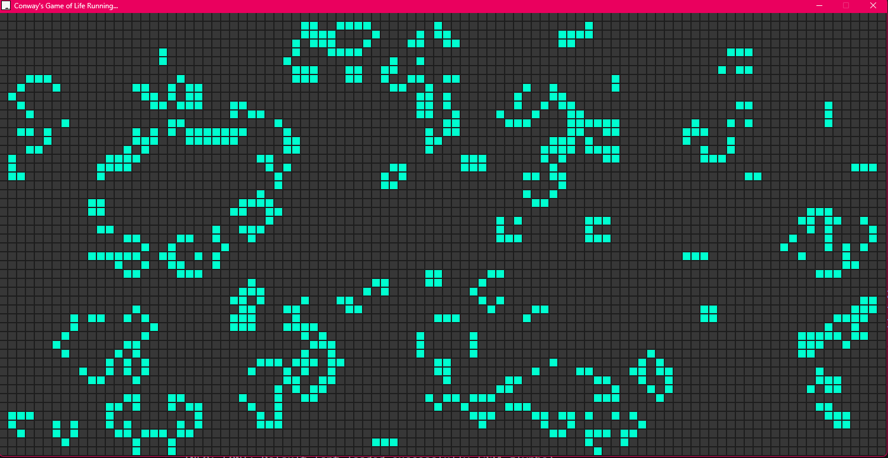

# 🧬 Conway's Game of Life (C++ / Raylib)

A high-performance, interactive implementation of **John Conway’s Game of Life**, built in **C++** using **Raylib**. Paint cells, control simulation speed, and watch complex patterns emerge in real time.

---

## 📖 About

The Famous Conway's Game of Life is a zero-player cellular automaton on a 2D grid where cells are either **alive** or **dead**, following these rules after the starting state is initialized:
- Live cells with fewer than 2 neighbors die (underpopulation)
- Live cells with 2–3 neighbors survive
- Live cells with more than 3 neighbors die (overpopulation)
- Dead cells with exactly 3 neighbors become alive (reproduction)

---

## 🎮 Controls

### Mouse (simulation paused)

| Action | Control |
|------|--------|
| Revive Cell | Left Click (Drag) |
| Kill Cell | Right Click (Drag) |

### Keyboard

| Key | Action |
|----|-------|
| `Enter` | Start simulation |
| `Space` | Pause simulation |
| `R` | Randomize grid |
| `C` | Clear grid |
| `↑ / ↓` | Increase / decrease speed (3–15 FPS) |
| `← / →` | Cycle cell colors (HSV) |

---

## 🚀 More Details

- **Language:** C++
- **Graphics:** Raylib
- **Architecture:**
  - `Grid` class for 2D cell storage
  - `Game` class for simulation logic
- **Visuals:** HSV-based color cycling
- **Window Size:** 1500 × 750
- **Cell Size:** 15px

---

## 📸 Preview



## How to Build and Run

This project uses a **portable Raylib setup**, so you do **not** need to install Raylib system-wide.

### Requirements
- C++ compiler (g++, clang, or MinGW)
- `make`

### Clone the Repository
```bash
git clone https://github.com/https://github.com/broken-proof/Raylib-Game-of-Life-Simulator.git
cd Raylib-Game-of-Life-Simulator
make
./game 
```

